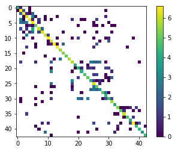

#**Traffic Sign Recognition** 

---

**Build a Traffic Sign Recognition Project**

The goals / steps of this project are the following:
* Load the data set (see below for links to the project data set)
* Explore, summarize and visualize the data set
* Design, train and test a model architecture
* Use the model to make predictions on new images
* Analyze the softmax probabilities of the new images
* Summarize the results with a written report

[//]: # (Image References)

[bar]: ./images/bar.png "Label distribution"
[visualisation]: ./images/visualisation.png "Images from each class"
[histEq]: ./images/histEq.png "Example before histogram equalised image"
[histEq2]: ./images/histEq.png "Example after histogram equalised image"
[exData]: ./images/bright0.png "Example for Data Aug"
[bright]: ./images/bright1.png "Example after random brightness"
[rot]: ./images/rot.png "Example after random rotation"
[training0]: ./images/97.png "Training for best model"
[training1]: ./images/02.png "Training for current model"
[image4]: ./images/0.jpg "Traffic Sign 1"
[image5]: ./images/1.jpg "Traffic Sign 2"
[image6]: ./images/2.jpg "Traffic Sign 3"
[image7]: ./images/3.jpg "Traffic Sign 4"
[image8]: ./images/4.jpg "Traffic Sign 5"
[weights]:./images/features.png "activations"

## Rubric Points
###Here I will consider the [rubric points](https://review.udacity.com/#!/rubrics/481/view) individually and describe how I addressed each point in my implementation.

---
###Writeup / README

####1. Provide a Writeup / README that includes all the rubric points and how you addressed each one. You can submit your writeup as markdown or pdf. You can use this template as a guide for writing the report. The submission includes the project code.

You're reading it! and here is a link to my [project code](https://github.com/arkhalid/CarND-Traffic-Sign-Classifier-Project/blob/master/Traffic_Sign_Classifier.ipynb)

###Data Set Summary & Exploration

####1. Basic Summary of Dataset

The code for this step is contained in the second and third code cell of the IPython notebook. I initially converted the pickle files to mat so that I could easily visualize the images using MATLAB. I noticed that the images have a lot of variation in the brightness.
I used the numpy library to calculate summary statistics of the traffic
signs data set:

* Number of training examples = 34799
* Number of validation examples = 34799
* Number of testing examples = 12630
* Image data shape = (32, 32)
* Number of classes = 43

####2. Exploratory Visualization of the Dataset

The code for this step is contained in the fourth code cell of the IPython notebook.

Here is an exploratory visualization of the data set. We show a label distribution of data in each class. 

![alt text][bar]

Here we visualise one image from each class.
![alt text][visualisation]
###Design and Test a Model Architecture

####1. Describe how, and identify where in your code, you preprocessed the image data. What tecniques were chosen and why did you choose these techniques? Consider including images showing the output of each preprocessing technique. Pre-processing refers to techniques such as converting to grayscale, normalization, etc.

The code for this step is contained in the cells under step 2. I experimented with multiple preprocessing techniques and used validation set accuracy to choose what to go for.I tried 4 types of preprocessing.
* Normalised RGB
--Having normalised values aids the training process. In my experiments I gained about 4 percent validation accuracy gain from 89 to 93 percent.
* Normalised HSV
--I also tried to use HSV input space for the image but it performed very similar to RGB in terms of validation accuracy thus I did not use it.
* Normalised Grayscale
-- It seems that the color of signs is important and thus we would lose information during this tranformation. However, counterintuitively this performs  better at 94.6 pc validation accuracy.
* Histogram Equalised Images
--If we take a look at the representative images, we notice that there are a lot of lighting differences. The intuition behind this preprocessing step was to equalise the brightness in all images. As historgram equalisation is only defined for grayscale images, I converted the images to LUV space and performed equalisation only on the L channel and conerted the images back to RGB. Although this approached seemed promising, it failed to yield extraordinary results, perhaps due to the introduction of artifacts. 

The rest of the transformations are straightforward. We show an example of hist eq below.

![alt text][histEq]
![alt text][histEq2]

####2. Describe how, and identify where in your code, you set up training, validation and testing data. How much data was in each set? Explain what techniques were used to split the data into these sets. (OPTIONAL: As described in the "Stand Out Suggestions" part of the rubric, if you generated additional data for training, describe why you decided to generate additional data, how you generated the data, identify where in your code, and provide example images of the additional data)

I used the splits that were part of the German Traffic Signs Dataset. If the validation set was not already there, I could have used the function from Scikitlearn to achieve the split.

My final training set had 34799 number of images. My validation set and test set had 4410 and 12630 number of images.

![alt text][exData]
![alt text][bright]
![alt text][rot]
It was found that just using this training data the system was overfitting. To address this I used data augmentation. I did not create a new training set with the augmented data. I used TensorFlow to apply the random perturbation to the samples during the training process. The brighness for the images was adjusted by a small random factor and the images were rotated slightly by a random angle. This gives us a potentially unique set of images to train during each epoch which should prevent overfitting.
Please see sample image with random brightness and random rotation below.

####3. Describe, and identify where in your code, what your final model architecture looks like including model type, layers, layer sizes, connectivity, etc.) Consider including a diagram and/or table describing the final model.

I started with the Lenet and adapted it to use color images as input. Lenet was overfitting on the data therefore I added some dropout layers to prevent this.

My final model consisted of the following layers:

| Layer         		|     Description	        					| 
|:---------------------:|:---------------------------------------------:| 
| Input         		| 32x32x3 RGB image   							| 
| Convolution 5x5x3x6   | 1x1 stride, valid padding, outputs 28x28x6 	|
| RELU					|												|
| Max pooling	      	| 2x2 stride, valid padding. outputs 14x14x6 	|
| Convolution 5x5x6x16	| 2x2 stride, valid padding, outputs 10x10x16	|
| RELU					|         										|
| Max Pooling			|2x2 stride, valid padding. outputs 5x14x16		|
|Flatten				|output 400										|
|FC						|output 120										|
|RELU					|												|
|Dropout				|p = 0.5										|
|FC						|output 84										|
|RELU					|												|
|Dropout				|p = 0.5										|
|FC						|output 43										|
|RELU					|												|
|Softmax				|												|

####4. Describe how, and identify where in your code, you trained your model. The discussion can include the type of optimizer, the batch size, number of epochs and any hyperparameters such as learning rate.

The code for training the model is located under the Train heading in the Ipython notebook.

For the training, I used the AdamOptimizer to minimize the cross entropy cost function. The advantage of this is that it automatically computes an adaptive learning rate which can be helpful in later iterations as compared to simple stochastic gradient descent. I chose a batch size of 128 and a learning rate of 0.002 after experimenting with multiple values for cross validation. I noticed that the model converges (i.e there is no significant improvement in validation error) between 30 and 50 Epochs. However for my final model I trained for 100 epochs.

Training graph for best model
![alt text][training0]
Training graph for current model
![alt text][training1]

####5. Describe the approach taken for finding a solution. Include in the discussion the results on the training, validation and test sets and where in the code these were calculated. Your approach may have been an iterative process, in which case, outline the steps you took to get to the final solution and why you chose those steps. Perhaps your solution involved an already well known implementation or architecture. In this case, discuss why you think the architecture is suitable for the current problem.

The code for calculating the accuracy of the model is located in the cell titled  accuracy in the Ipython notebook.

My final model results were:
* training set accuracy of 0.994
* validation set accuracy of 0.956
* test set accuracy of 0.946

To come up with the solution I took an iterative approach:
* I started with the LeNet network and converted the first convolution layer to take color images
* This gave me a training accuracy of about 98 pc and a validation accuracy of 90 pc
* I noticed that the images had a lot of variation in lighting which it seemed to me was making it difficult for the network to learn.
* To address it I added a preprocessing step that converted the image to LUV space, perfomed histogram equalisation on the L layer and converted back to RGB.
* With some hyperparameter tuning on this approach I was able to take the validation accuracy to 93 percent and training accuracy of 99.7 percent.
* At this point the network was overfitting as there was a large gap between training and validation accuracy.
* To address this I added dropout of 0.5 after the fully connected layers.
* This did not work well and the accuracy of the network dropped to 88 pc.
* After looking at some of the images after the histogram equalisation step, I noticed that this step was introducing artifacts in the image.
* At this point I decided to experiment with just the normalised RGB images and got a validation set accuracy to 93.5 which was comaprable to the histogram equalised images without dropout.
* This encouraged me to try dropout with normalised RGB images and helped bump up the validation set accuracy to 96 pc.
* To further improve generalisation, I added data augmentation as random changes in brightmess and random rotation. The data augmentation for brightness gave a 1 pc increase in validation accuracy, however adding the rotation augmentation dropped it again.
* I still need to investigate why rotation augmentation by about 0.2 radians is decreasing the accuracy.
* I also added xavier initialisation for weights but did not notice significant performance gain.
* The problem is well suited to a CNN as it exibits characteristics of translation invariance as it doesnot matter where in the image the sign is, rather we are only concerned with identifying it.

###Test a Model on New Images

####1. Choose five German traffic signs found on the web and provide them in the report. For each image, discuss what quality or qualities might be difficult to classify.

Here are five German traffic signs that I found on the web:

![alt text][image4] ![alt text][image5] ![alt text][image6] 
![alt text][image7] ![alt text][image8]
In case of the first image we have multiple speed signs which may confuse the system into thinking that it is some other speed limit. 
The second image is taken with a perspective.
The third image should be unique and strightforward to identify.
The fourth and fifth image are of warning signs of which many are present.These should have a higher change of confusion.

####2. Discuss the model's predictions on these new traffic signs and compare the results to predicting on the test set. Identify where in your code predictions were made. At a minimum, discuss what the predictions were, the accuracy on these new predictions, and compare the accuracy to the accuracy on the test set (OPTIONAL: Discuss the results in more detail as described in the "Stand Out Suggestions" part of the rubric).

The code for making predictions is in the cell titled " Predict the Sign Type for Each Image"

Here are the results of the prediction:

| Image			        |     Prediction	        				| 
|:---------------------:|:---------------------------------------------:| 
| 50 km/h      		| 50 km/h   									| 
| Stop    			| Stop 										|
| Yield				| Yield											|
| Pedestrians	    | General Caution					 				|
| Road Work			| Road Work     							|

The model was able to correctly guess 3 of the 5 traffic signs, which gives an accuracy of 60%. This is somewhat lower than the test data accuracy but the signs that were chosen were those which were easier to confuse.
Let's look at 50 km/h which is label number 2 in the confusion matrix. It can be seen that it is confused with the other speed limit signs. This is perhaps because the network wasn't able to learn the text inside the speed limit sign very accurately.

Similarly the pedestrian sign looks very similar to general caution as it the pedestrian can be cconfused for an exclamation mark in low resolution. This trednd can also be seen in the confusion matrix as labels such as pedestrians, children crossing, signal ahead and bicycle crossing are predicted as caution.

Class: 2 Recall: 0.977333333333 Precision: 0.97603195739
Class: 13 Recall: 0.990277777778 Precision: 0.995810055866
Class: 14 Recall: 1.0 Precision: 0.957446808511

####3. Describe how certain the model is when predicting on each of the five new images by looking at the softmax probabilities for each prediction and identify where in your code softmax probabilities were outputted. Provide the top 5 softmax probabilities for each image along with the sign type of each probability. (OPTIONAL: as described in the "Stand Out Suggestions" part of the rubric, visualizations can also be provided such as bar charts)

The code for making predictions on my final model is located in the cell titled "Predict the Sign Type for Each Image" of the Ipython notebook.

For the first image, the model is really sure that this is a speed limit (30km/h) but is actually a speed limit (50km/h) sign. It seems like the model didn't learn to distinguish the characters inside the signs correctly. 

| Probability         	|     Prediction	        					|
|:---------------------:|:---------------------------------------------:|
| .98         			| Speed limit (30km/h)							|
| .01     				| Speed limit (50km/h) 							|
| 2.27e-12				| Speed limit (80km/h)							|
| 5.67e-13	      		| Speed limit (100km/h)					 		|
| 1.95e-13			    | Speed limit (60km/h)    						|

Speed limit (50km/h): Recall: 0.977333333333 Precision: 0.97603195739
High precision and recall. Not sure why this failed.

For the second image, the model is fairly confident that this is a stop sign which is indeed the case.

| Probability         	|     Prediction	        					|
|:---------------------:|:---------------------------------------------:|
| .70        			| Stop											|
| .22     				| Bicycle Crossing 								|
| .04					| Yield											|
| 0.01	      			| Bumpy Road				 					|
| 0.01			    	| Pedestrians 									|

Stop Sign: 14 Recall: 1.0 Precision: 0.957446808511

For the third image, the model is completely certain that this is a yield sign which is indeed the case.

| Probability         	|     Prediction	        					|
|:---------------------:|:---------------------------------------------:|
| 1.0        			| Yield											|
| 0.0     				| Speed limit (20km/h) 							|
| 0.0					| Speed limit (30km/h)							|
| 0.0	      			| Speed limit (50km/h)			 				|
| 0.0			    	| Speed limit (60km/h)							|
Yield Sign: 13 Recall: 0.990277777778 Precision: 0.995810055866

For the fourth image, the model incorrectly labels the pedestrian sign as the general caution sign. It appears that the low resolution is causing the person in the pedestrian sign to appear very similar to the exclamation mark in the caution sign. We see that Pedestrian is the 2nd choice however the probabilities indicate that the classifier predicted that as very unlikely.

| Probability         	|     Prediction	        					|
|:---------------------:|:---------------------------------------------:|
|1.0        			|General Caution								|
|8.88e-16    			|Pedestrian 									|
|1.55e-19				|Speed limit (30km/h)							|
|6.44e-21      			| Speed limit (70km/h)			 				|
|6.96e-22		    	| Speed limit (20km/h)							|

Pedestrian: Recall: 0.466666666667 Precision: 0.636363636364

For the fifth image, the model correctly predicts the road work sign with very high confidence.

| Probability         	|     Prediction	        					|
|:---------------------:|:---------------------------------------------:|
|.99        			|General Caution								|
|3.97e-06    			|Pedestrian 									|
|6.20e-09				|Speed limit (30km/h)							|
|8.66e-15      			| Speed limit (70km/h)			 				|
|2.10e-15		    	| Speed limit (20km/h)							|

Road Work: Recall: 0.960416666667 Precision: 0.895145631068

### Visualizing the learned feature maps
I looked at the activations triggered from the yield sign test image. IF we look at the output of the first convolution layer, we see that the first filter map 0 looks at genral edge shape of the yield size. Filter 1 looks like a negative map of the yield sign perhaps used for other signs to disambiguate. Filter map three is perhaps looking at empty space within the yield sign. Filter 4 and 5 seem to be edge detecters for certain angles.
![alt text][weights]